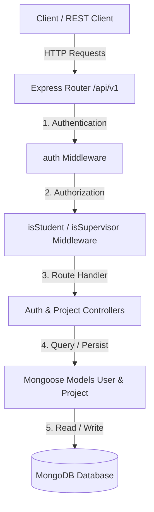
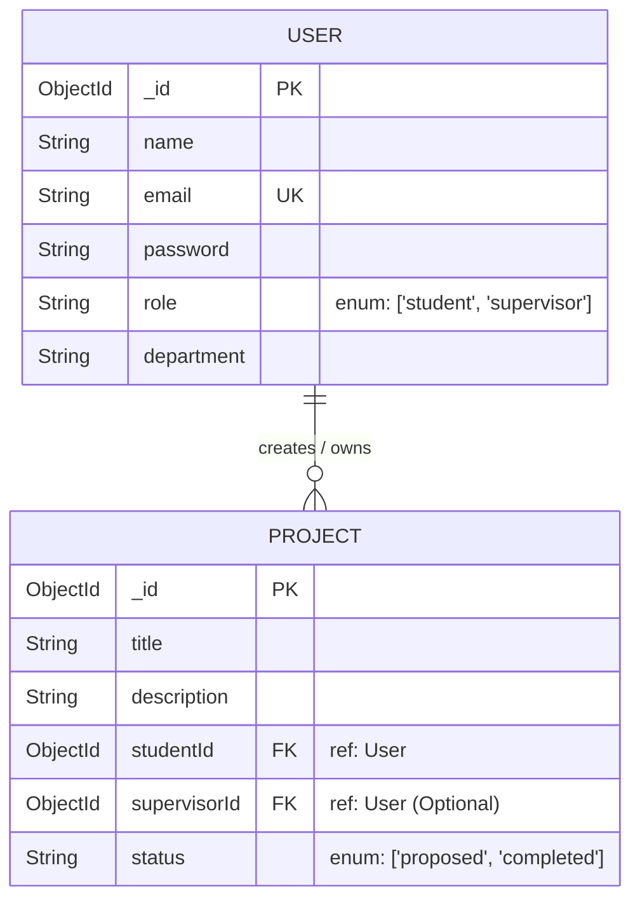

# Role-Based Access Control (RBAC) System

A secure RESTful API built with Node.js, Express, and MongoDB that implements Role-Based Access Control (RBAC) for academic project management between students and supervisors.

---

## Overview

The **Role-Based Access Control (RBAC) System** is a backend service designed to handle authentication, authorization, and role-restricted resource management. In academic environment settings, students and faculty supervisors require distinct access permissions when managing academic projects.

This project addresses access management by enforcing fine-grained, role-based authorization rules at both the API route and controller layers:
- **Students** can register, log in, create new projects, and view/manage only their own submitted projects.
- **Supervisors** possess administrative oversight, enabling them to inspect all student projects across departments, update project statuses, and remove project records.

---

## Features

- **User Authentication & Authorization**: Secure signup and login workflows leveraging JSON Web Tokens (JWT) and HTTP cookies.
- **Password Security**: Password hashing using `bcrypt` with salt rounds prior to persistence.
- **Role-Based Access Control (RBAC)**: Custom middleware guards (`isStudent`, `isSupervisor`) restricting route access by user role.
- **Resource Ownership Scoping**: Controller-level checks ensuring students can only view and query projects tied to their account ID.
- **Project CRUD Operations**: Full lifecycle management for academic projects, including project creation, retrieval, updates, and deletion.
- **Schema Validation & Constraints**: Mongoose validation for user roles (`student`, `supervisor`) and project status (`proposed`, `completed`).
- **Standardized Error Handling**: Structured JSON API error responses with appropriate HTTP status codes (200, 201, 400, 401, 403, 404, 500).

---

## Tech Stack

| Category | Technologies |
| --- | --- |
| **Backend** | Node.js, Express.js |
| **Database** | MongoDB, Mongoose ODM |
| **Authentication** | JSON Web Tokens (`jsonwebtoken`), `bcrypt`, `cookie-parser` |
| **Configuration** | `dotenv` |
| **API Format** | RESTful JSON APIs |
| **Development Tools** | npm, Postman / REST Client |

---

## Project Architecture

The application follows a layered Node.js/Express MVC architecture with stateless JWT-based authentication.



### Communication Flow

1. **Client Request**: The client sends an HTTP request containing payload data or a JWT authentication token (via cookies or request body).
2. **Authentication Layer**: The `auth` middleware verifies the JWT against `JWT_SECRET` and attaches the decoded user payload (`id`, `email`, `role`) to `req.user`.
3. **Authorization Guard**: Role-specific middlewares (`isStudent`, `isSupervisor`) evaluate `req.user.role` to ensure authorization before allowing execution.
4. **Data Isolation Layer**: Controllers execute business logic and database operations, enforcing ownership scoping (e.g., filtering projects by `req.user.id` for students).
5. **Database Interaction**: Mongoose schemas interact with MongoDB to perform queries and persist data.

---

## Project Structure

```text
class5-auth/
├── config/
│   └── dataBaseconn.js      # MongoDB database connection setup
├── controllers/
│   ├── auth.js              # Authentication controllers (Signup, Login)
│   └── project.js           # Project management CRUD controllers
├── middlewares/
│   └── auth.js              # Auth & RBAC middlewares (auth, isStudent, isSupervisor)
├── model/
│   ├── projectSchema.js     # Mongoose Schema for Projects
│   └── userSchema.js        # Mongoose Schema for Users
├── routes/
│   └── user.js              # API route definitions and middleware application
├── .env                     # Environment variables configuration (git-ignored)
├── index.js                 # Express application entry point & server initialisation
├── package.json             # Project dependencies and npm scripts
└── README.md                # Project documentation
```

---

## Getting Started

Follow these instructions to set up and run the project locally.

### Prerequisites

Ensure you have the following installed on your local machine:
- **Node.js**: `v14.x` or higher
- **npm**: `v6.x` or higher
- **MongoDB**: A local MongoDB server instance or a [MongoDB Atlas](https://www.mongodb.com/cloud/atlas) cluster connection string.

### Installation

1. **Clone the repository**:
   ```bash
   git clone https://github.com/your-github-username/role-base-acess.git
   cd role-base-acess
   ```

2. **Install dependencies**:
   ```bash
   npm install
   ```

### Environment Variables

Create a `.env` file in the root directory of the project and define the required variables:

```env
PORT=4000
DataBase_URL=your_mongodb_connection_string
JWT_SECRET=your_jwt_secret_key
```

> **Note**: Replace `your_mongodb_connection_string` and `your_jwt_secret_key` with your actual local or cloud configuration values. Never commit your `.env` file to source control.

### Running the Project

To start the backend server:

```bash
node index.js
```

Upon successful connection, you will see output indicating:
```text
Data Base Connection Established Successfully
Server is start listning at 4000
```

---

## API Documentation

All API routes are prefixed with `/api/v1`.

### Authentication Endpoints

| Method | Endpoint | Access | Description |
| --- | --- | --- | --- |
| `POST` | `/api/v1/users/register` | Public | Register a new user with `name`, `email`, `password`, `role` (`student` or `supervisor`), and optional `department`. |
| `POST` | `/api/v1/users/login` | Public | Authenticate a user with `email` and `password`. Returns JWT token and sets HTTP cookie. |

### Protected & Role Testing Endpoints

| Method | Endpoint | Access | Description |
| --- | --- | --- | --- |
| `GET` | `/api/v1/test` | Authenticated | Verification endpoint for any authenticated user with a valid JWT token. |
| `GET` | `/api/v1/supervisor` | Supervisor Only | Protected test route accessible exclusively to users with the `supervisor` role. |

### Project Management Endpoints

| Method | Endpoint | Access | Description |
| --- | --- | --- | --- |
| `POST` | `/api/v1/projects` | Student Only | Create a new project. Accepts `title` and `description` in body; automatically links `user` to `req.user.id`. |
| `GET` | `/api/v1/projects` | Authenticated | Fetch projects. **Students** receive only their own projects; **Supervisors** receive all projects. |
| `GET` | `/api/v1/projects/:id` | Authenticated | Fetch project by ID. **Students** can only view their own project; **Supervisors** can view any project. |
| `PUT` | `/api/v1/projects/:id` | Supervisor Only | Update an existing project's fields by project ID. |
| `DELETE` | `/api/v1/projects/:id` | Supervisor Only | Delete a project record by project ID. |

---

## Database

The application utilizes **MongoDB** paired with **Mongoose ODM** for schema definition, validation, and database operations.



### Models & Schema Definitions

1. **User Model (`User`)**:
   - `name` (String, required, trimmed)
   - `email` (String, required, unique, trimmed)
   - `password` (String, required, bcrypt hashed)
   - `role` (String, required, enum: `["student", "supervisor"]`)
   - `department` (String, default: `null`)

2. **Project Model (`Project`)**:
   - `title` (String, required, trimmed)
   - `description` (String, required, trimmed)
   - `studentId` (ObjectId, ref: `User`, required)
   - `supervisorId` (ObjectId, ref: `User`, default: `null`)
   - `status` (String, required, enum: `["proposed", "completed"]`)

---

## Screenshots

Screenshots will be added soon.

---

## Usage

### Typical User Flow

1. **User Registration**:
   - A user submits a POST request to `/api/v1/users/register` specifying their role (`student` or `supervisor`).

2. **Authentication**:
   - The user logs in via `/api/v1/users/login`.
   - The server validates credentials, generates a signed JWT token valid for 2 hours, and sets it in an HTTP cookie or returns it in the response payload.

3. **Student Workflow**:
   - The student attaches the JWT token to subsequent requests.
   - The student posts a project via `/api/v1/projects`.
   - The student queries `/api/v1/projects` or `/api/v1/projects/:id` to inspect their submitted projects.

4. **Supervisor Workflow**:
   - The supervisor logs in with supervisor credentials.
   - The supervisor issues a GET request to `/api/v1/projects` to review all student project submissions across the platform.
   - The supervisor can update project status or details via `PUT /api/v1/projects/:id` or remove projects via `DELETE /api/v1/projects/:id`.

---

## Important Technical Highlights

- **Multi-Level Authorization**: Enforces authorization guards at the route level (`isStudent`/`isSupervisor` middlewares) as well as data-level authorization checks inside controller actions.
- **Role-Aware Response Filtering**: The `getProjects` and `getProjectById` controllers dynamically adjust data retrieval based on `req.user.role`, eliminating the need for separate endpoint paths for different user tiers.
- **Secure Password Hashing & Sanitation**: Utilizes `bcrypt` hashing with salt factor 10. Sanitizes authentication response objects by stripping password fields prior to sending responses.
- **Flexible Token Extraction**: Middleware checks for JWT availability across both `req.cookies.token` and `req.body.token` for seamless integration with web clients or API testing tools.

---

## Challenges & Solutions

### Challenge 1: Dynamic Data Access Control Based on User Context
**Issue**: Preventing student users from discovering or accessing project records submitted by peers while granting supervisors complete system visibility without maintaining duplicate controller logic.  
**Solution**: Built dynamic role branching within the `getProjects` and `getProjectById` controller actions. The controllers evaluate `req.user.role` from the verified JWT payload: querying `{ user: req.user.id }` for students and executing an unfiltered search for supervisors.

### Challenge 2: Stateless Role Guard Middleware Architecture
**Issue**: Ensuring route handlers remain clean and modular without duplicating JWT verification and permission checks across controllers.  
**Solution**: Architected a chainable middleware pattern where `auth` decodes and verifies the token payload, passing execution to specialized role guards (`isStudent`, `isSupervisor`) which validate the role property before invoking `next()`.

---


---

## Testing

Automated tests are not currently configured.

---

## Deployment

Deployment configuration is not currently included.

---

## Author

**Your Name**

- GitHub: [RanaFarhan10](https://github.com/RanaFarhan10)
- LinkedIn: [Rana Farhan Qamar](https://www.linkedin.com/in/rana-farhan-qamar/)

---

## License

This project is licensed under the [ISC License](LICENSE).
